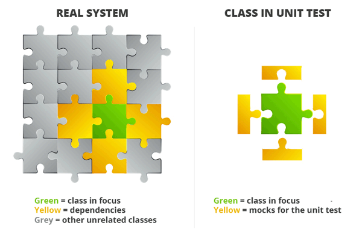
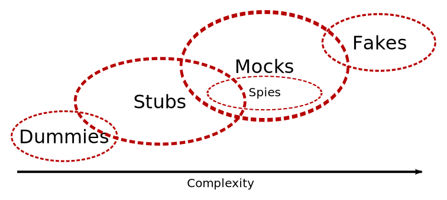

= Python - Tester avec les Doubles
Rémi PICARD <picard.remi@gmail.com>
:website: https://remi-picard.github.io/cv/
:lang: fr
:source-highlighter: highlightjs
:highlightjs-theme: reveal.js/lib/css/zenburn.css
:revealjs_history: true
:revealjs_theme: white
:revealjs_slideNumber: true
:revealjs_mouseWheel: true
:customcss: assets/presentation.css

////
:doctype: book
:reproducible:
:source-highlighter: coderay
:listing-caption: Listing
:pdf-page-size: Letter
////

== Pourquoi tester ?

- Détecter automatiquement les régressions
- Vérifier que le code est modulaire / facilement réutilisable
- Permet de documenter

== Structure d'un test

- **A**rrange / Given => Préparation des données d'entrée
- **A**ct     / When  => Appel de la méthode à tester
- **A**ssert  / Then  => Vérifications (retour, changement d'état)

== Structure d'un test

[source,python]
----
def test_simple():
    # ARRANGE
    a = 1
    b = 2

    # ACT
    got = a + b

    # ASSERT
    assert got == 3

def test_very_simple():
    assert 1 + 2 == 3
----

== Fonctions pures

- Des entrées
- Une sortie
- On ne modifie pas les entrées
- Pas d'effet de bord
- Très simple à tester

== Framework de tests

- pytest
- unittest

🏆 pytest : Léger, compatible, markers/fixtures/paramétrisation

Mais aussi doctest, hypothesis ...

== Dans la vraie vie ...

=== Effets de bord

- Commande système
- File System
- Connexion à une base de données

=== Dépendances

=== Entrées complexes

- Retour d'une API (DataScience, Base de données...)
- Pas de constructeur

=== Structure d'un test avec Double

- Arrange / Given => Préparation des données d'entrée et des doubles
- Act     / When  => Appel de la méthode à tester
- Assert  / Then  => Vérifications (**appels de méthode**)

== Les Doubles 🦄🦄

=== Dummies ~ Nulles

Valeurs non utilisées par le code. Elles permettent de remplir les paramètres des méthodes à tester.

[source,python]
----
# Source
def do_some_stuff(param1, param2):
    if param1 == 42:
        return False
    # ...
    if param2 % param1 == 5:
        return True
    return None

# Test
def test_dummies():
    dummy = None
    assert not do_some_stuff(42, dummy)
----

=== Stubs ~ Bout, moignon

Objet qui produit les réponses dont on a besoin pour faire passer le test.

[source,python]
----
# Source
import math
def get_cosinus(x):
    return math.cos(x)

# Test
def test_stubs_math_cos(monkeypatch):
    def stub_cos(*args, **kwargs):
        return args[0]
    monkeypatch.setattr(math, 'cos', stub_cos)
    assert get_cosinus(5) == 5
----

=== Mocks ~ 🤡 / Spies ~ Espions

Objet type proxy qui enregistre s'il a été appelé et avec quels paramètres.

Un **Mock** est une coquille vide qui ne retourne rien.

Un **Spy** appelle le code de l'objet qu'il remplace. On ne surcharge que certaines méthodes.

🧙‍♂️ Démo

=== Fake objects ~ Faux, truqués

Objet remplaçant la dépendance avec une implémentation fonctionnelle mais qui ne sera pas utilisée en production.

Exemple : Base de données en mémoire

=== Framework de Doubles

- mock ~ unittest.mock (dispo pour python >= 3.3)
- monkeypatch

=== Récap

|=======
|Replacement des dépendances |Vérification des interactions
|Dummies                     |Spy
|Stubs                       |Mock
|Fakes                       |
|=======

=== Complexité

=== Limites

- On ne teste pas l'intégration des composants
- Compliqué à écrire si de nombreuses dépendances
- Maintenance très coûteuse (tous les mocks à réécrire si l'API change)
- Certains cas ne se produiront pas en production

== Références

https://martinfowler.com/bliki/TestDouble.html[Martin Fowler - TestDouble]

https://app.pluralsight.com/library/courses/using-unit-testing-python/table-of-contents[Emily Bache - Unit Testing with Python]

http://xunitpatterns.com/Test%20Double%20Patterns.html[xUnit Patterns]

https://ervin.ipsquad.net/slides/talks/ak2015-test-doubles/#/[Franck Arrecot & Kevin Ottens - Test Doubles]

https://piraveenaparalogarajah.medium.com/what-is-mocking-in-testing-d4b0f2dbe20a[What is Mocking in Testing?]

== Des questions ?

Merci pour votre attention.